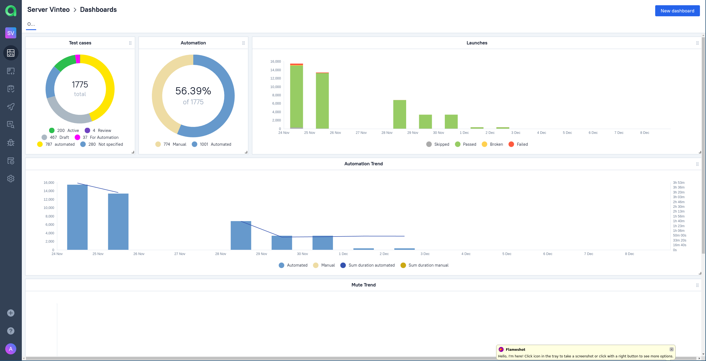
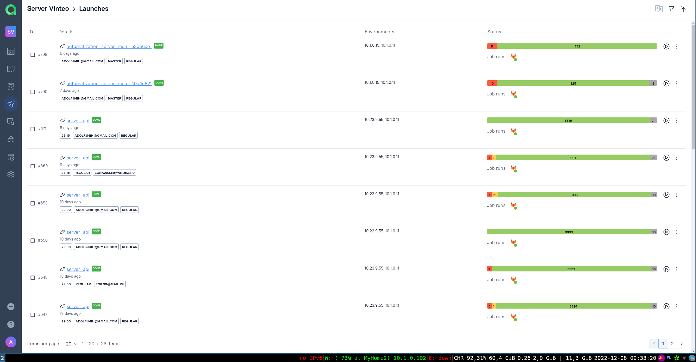
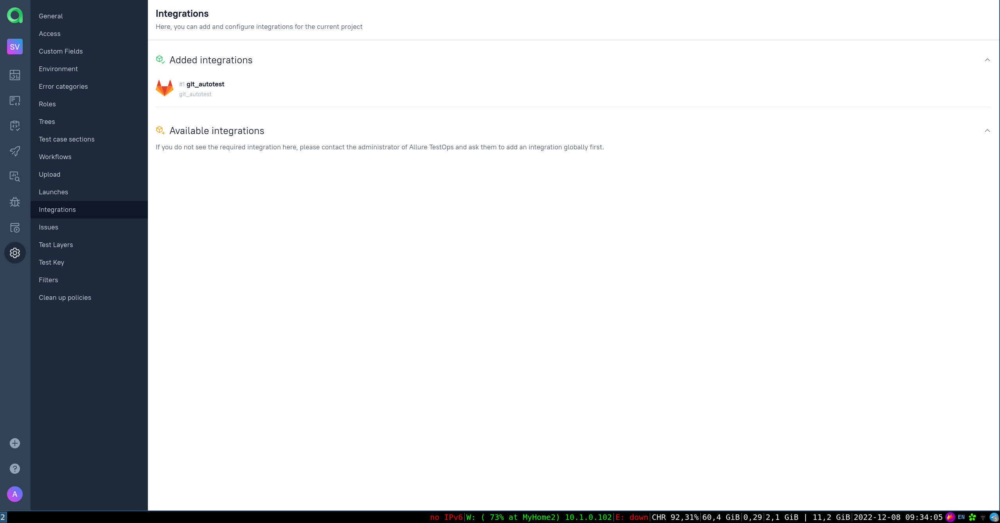

Проект тестирования сервера ВКС Vinteo:
- тесты web интерфейса 
- тесты api

Используется в проекте:
- AllureReport
- Jenkins
- AllureTestOps
- Selene
- Selenoid
- Python
- Pytest

Пример интеграции с allureTestOps

    
    
    

        
В проекте содержится небольшое количество автотестов WEB интерфейса и API сервера ВКС vinteo. 
Доступ к запуску автотестов будет закрыт после сдачи этого проекта.
